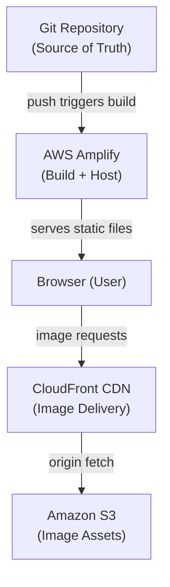
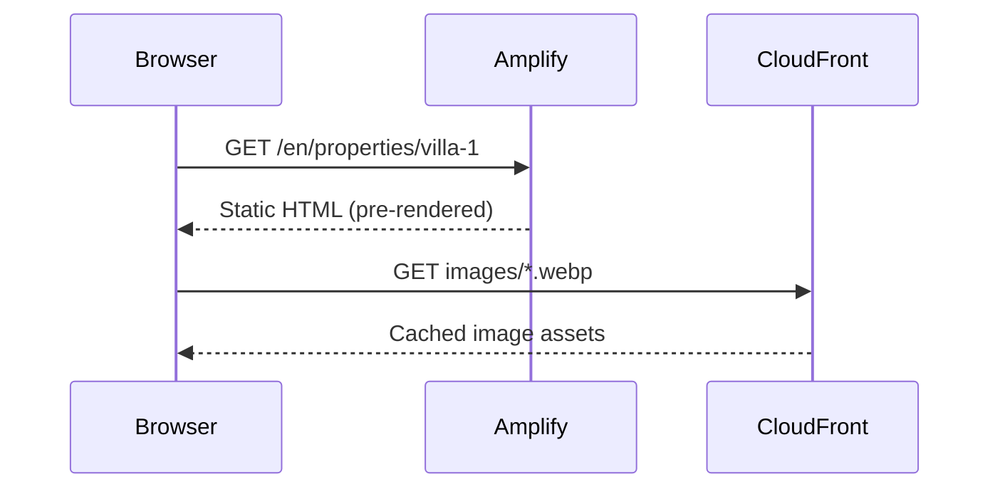

# Design Document: Mira Real Estate Website

## Overview

Mira is a promotional real estate website targeting the Koh Samui, Thailand property market. The site showcases villa and townhouse listings to an international audience, primarily European buyers, with the goal of converting visitors into inquiry leads via WhatsApp and Line contact.

The architecture is a statically-generated Next.js 14 App Router site with multilingual support (6 languages via next-intl), deployed on AWS Amplify, with images served from Amazon S3 + CloudFront CDN. Property data is managed as JSON files — no database required. The design aesthetic is Tropical Luxury: Ocean Blue, Sand Gold, and clean white space.

Key design decisions:
- Static generation (`generateStaticParams`) for all property pages — fast loads, SEO-friendly, no server runtime cost
- next-intl with JSON message files for i18n — simple, well-supported, works with App Router
- Pannellum loaded client-side only (dynamic import with `ssr: false`) — avoids SSR issues with browser APIs
- GA4 + Facebook Pixel injected only in production via Next.js Script component
- CloudFront CDN for all images — global low-latency delivery

---

## Architecture

### High-Level Architecture



### Request Flow



### Deployment Architecture

- AWS Amplify hosts the Next.js static export (`output: 'export'`)
- `amplify.yml` defines build commands and output directory (`out/`)
- SSL certificate managed automatically by Amplify
- S3 bucket stores all property images; CloudFront distribution sits in front
- Git push to `main` triggers automatic Amplify build and deploy

---

## Components and Interfaces

### Project Structure

```
mira-real-estate-website/
├── app/
│   └── [locale]/
│       ├── layout.tsx              # Root layout with i18n provider, tracking scripts
│       ├── page.tsx                # Homepage
│       ├── properties/
│       │   └── [id]/
│       │       └── page.tsx        # Property detail page
│       └── not-found.tsx           # 404 page
├── components/
│   ├── layout/
│   │   ├── Navbar.tsx              # Navigation bar with logo + language switcher
│   │   └── Footer.tsx              # Footer with copyright + contact info
│   ├── home/
│   │   ├── HeroSection.tsx         # Full-screen hero with background image + tagline
│   │   └── FeaturedProperties.tsx  # Grid of featured PropertyCards
│   ├── property/
│   │   ├── PropertyCard.tsx        # Summary card: thumbnail, price, area, beds, baths
│   │   ├── ImageCarousel.tsx       # Image carousel for detail page
│   │   └── PanoramaViewer.tsx      # Pannellum 360° viewer (client-only)
│   ├── common/
│   │   ├── ContactButton.tsx       # Floating WhatsApp + Line button
│   │   └── LanguageSwitcher.tsx    # Language dropdown in navbar
│   └── tracking/
│       └── TrackingScripts.tsx     # GA4 + Facebook Pixel script injection
├── data/
│   └── properties.json             # All property listings
├── messages/
│   ├── en.json                     # English translations
│   ├── ru.json                     # Russian translations
│   ├── fr.json                     # French translations
│   ├── de.json                     # German translations
│   ├── es.json                     # Spanish translations
│   └── it.json                     # Italian translations
├── lib/
│   ├── properties.ts               # Property data access helpers
│   └── tracking.ts                 # Tracking event helpers (GA4 + Pixel)
├── public/
│   └── og-default.jpg              # Default OG image (1200×630)
├── i18n.ts                         # next-intl configuration
├── middleware.ts                   # next-intl locale routing middleware
├── next.config.ts                  # Next.js config (image domains, i18n, output)
├── tailwind.config.ts              # Tailwind theme (colors, fonts)
└── amplify.yml                     # AWS Amplify build config
```

### Component Interfaces

#### PropertyCard

```typescript
interface PropertyCardProps {
  id: string
  title: string
  price: number
  currency: string
  area_sqm: number
  bedrooms: number
  bathrooms: number
  location: string
  images: string[]
  locale: string
}
```

#### PanoramaViewer

```typescript
interface PanoramaViewerProps {
  panoramaUrl: string
  hotspots?: PanoramaHotspot[]
}

interface PanoramaHotspot {
  pitch: number
  yaw: number
  targetPanoramaUrl: string
  label: string
}
```

#### ContactButton

```typescript
interface ContactButtonProps {
  whatsappNumber: string  // e.g. "66812345678"
  lineId: string          // e.g. "mira_realestate"
  onContact?: (channel: 'whatsapp' | 'line') => void
}
```

#### TrackingScripts

```typescript
interface TrackingScriptsProps {
  ga4MeasurementId: string   // e.g. "G-XXXXXXXXXX"
  fbPixelId: string          // e.g. "123456789012345"
}
```

### Routing Structure

next-intl uses a `[locale]` dynamic segment at the root:

```
/en                    → Homepage (English)
/ru                    → Homepage (Russian)
/en/properties/[id]    → Property detail (English)
/ru/properties/[id]    → Property detail (Russian)
```

Middleware (`middleware.ts`) handles locale detection and redirects from `/` to `/{defaultLocale}`.

---

## Data Models

### Property JSON Schema

All property data lives in `/data/properties.json` as an array of `Property` objects.

```typescript
interface Property {
  id: string                  // URL-safe slug, e.g. "beachfront-villa-chaweng"
  title: string               // Property name
  price: number               // Numeric price
  currency: string            // ISO 4217 code, e.g. "THB" or "USD"
  area_sqm: number            // Built area in square meters
  land_sqm: number            // Land area in square meters
  bedrooms: number
  bathrooms: number
  location: string            // Human-readable location, e.g. "Chaweng, Koh Samui"
  description: string         // Full property description
  images: string[]            // Array of CloudFront image URLs (min 3 for detail page)
  panorama_url?: string       // Optional: Pannellum-compatible equirectangular image URL
  panorama_hotspots?: PanoramaHotspot[]  // Optional: room navigation hotspots
  featured: boolean           // Whether to show on homepage featured list
}
```

Example entry:

```json
{
  "id": "beachfront-villa-chaweng",
  "title": "Beachfront Villa Chaweng",
  "price": 25000000,
  "currency": "THB",
  "area_sqm": 320,
  "land_sqm": 800,
  "bedrooms": 4,
  "bathrooms": 3,
  "location": "Chaweng, Koh Samui",
  "description": "Stunning beachfront villa with panoramic sea views...",
  "images": [
    "https://cdn.example.com/properties/villa-chaweng/main.webp",
    "https://cdn.example.com/properties/villa-chaweng/living.webp",
    "https://cdn.example.com/properties/villa-chaweng/bedroom.webp"
  ],
  "panorama_url": "https://cdn.example.com/panoramas/villa-chaweng/living-room.jpg",
  "panorama_hotspots": [
    { "pitch": 0, "yaw": 90, "targetPanoramaUrl": "...bedroom.jpg", "label": "Bedroom" }
  ],
  "featured": true
}
```

### Translation Message Schema

Each `messages/{locale}.json` file follows this structure:

```json
{
  "nav": {
    "home": "Home",
    "properties": "Properties",
    "contact": "Contact"
  },
  "hero": {
    "tagline": "Your Dream Villa in Koh Samui",
    "subtitle": "Luxury properties in paradise"
  },
  "property": {
    "price": "Price",
    "bedrooms": "Bedrooms",
    "bathrooms": "Bathrooms",
    "area": "Built Area",
    "land": "Land Area",
    "location": "Location",
    "viewTour": "View 360° Tour",
    "contactUs": "Contact Us"
  },
  "contact": {
    "whatsapp": "WhatsApp",
    "line": "Line"
  },
  "footer": {
    "copyright": "© 2024 Mira Real Estate. All rights reserved."
  },
  "errors": {
    "notFound": "Property not found",
    "backHome": "Back to Homepage"
  }
}
```

### i18n Configuration

```typescript
// i18n.ts
import { getRequestConfig } from 'next-intl/server'

export const locales = ['en', 'ru', 'fr', 'de', 'es', 'it'] as const
export type Locale = typeof locales[number]
export const defaultLocale: Locale = 'en'

export default getRequestConfig(async ({ locale }) => ({
  messages: (await import(`./messages/${locale}.json`)).default
}))
```

### Tailwind Theme Configuration

```typescript
// tailwind.config.ts (theme extension)
colors: {
  'ocean-blue': '#0EA5E9',
  'sand-gold':  '#F59E0B',
  'off-white':  '#FFFFFF',
  'light-gray': '#F9FAFB',
  'dark-gray':  '#1F2937',
}
fontFamily: {
  sans: ['Inter', 'Poppins', 'sans-serif'],  // Latin + Cyrillic coverage via Inter
}
```

Inter covers Cyrillic (Russian) and all Latin-extended characters needed for French, German, Spanish, and Italian — no additional font loading required.

---

## Correctness Properties

*A property is a characteristic or behavior that should hold true across all valid executions of a system — essentially, a formal statement about what the system should do. Properties serve as the bridge between human-readable specifications and machine-verifiable correctness guarantees.*


### Property 1: Featured property count is within bounds

*For any* dataset of properties, filtering by `featured === true` should return between 3 and 6 properties for display on the homepage.

**Validates: Requirements 1.2**

### Property 2: PropertyCard renders all required fields

*For any* valid property object, the rendered `PropertyCard` component should contain the property's thumbnail image, price, built area, number of bedrooms, number of bathrooms, and location.

**Validates: Requirements 1.3**

### Property 3: PropertyCard links to correct detail page

*For any* property with a given `id`, the `PropertyCard` should render a link whose `href` navigates to `/[locale]/properties/[id]`.

**Validates: Requirements 1.4**

### Property 4: Property detail page renders all required fields

*For any* valid property object, the rendered property detail page should display the price, built area, land area, number of bedrooms, number of bathrooms, and location.

**Validates: Requirements 2.2**

### Property 5: Image carousel renders all property images

*For any* property with N images (N ≥ 3), the `ImageCarousel` component should render exactly N image elements.

**Validates: Requirements 2.1**

### Property 6: PanoramaViewer conditionally rendered

*For any* property object, the detail page should render the `PanoramaViewer` component if and only if `panorama_url` is present and non-empty.

**Validates: Requirements 2.3**

### Property 7: PanoramaViewer receives hotspots when present

*For any* property with `panorama_hotspots`, the `PanoramaViewer` should receive all hotspots as props; for any property without hotspots, the viewer should receive an empty or undefined hotspots prop.

**Validates: Requirements 2.5**

### Property 8: Contact button link URLs are correctly formatted

*For any* WhatsApp phone number string, the generated link should equal `https://wa.me/{phone_number}`; for any Line ID string, the generated link should equal `https://line.me/ti/p/{line_id}`.

**Validates: Requirements 3.3, 3.4**

### Property 9: All pages include required OG and Twitter meta tags

*For any* rendered page, the HTML `<head>` should contain `og:title`, `og:description`, `og:image`, `og:url`, `twitter:card`, `twitter:title`, and `twitter:image` meta tags.

**Validates: Requirements 4.1, 4.4**

### Property 10: Property detail OG tags match property data

*For any* property object, the OG meta tags on its detail page should use the property's `title` as `og:title`, the property's `description` as `og:description`, and the first element of `images` as `og:image`.

**Validates: Requirements 4.2**

### Property 11: Tracking scripts absent outside production

*For any* environment where `NODE_ENV !== 'production'`, the rendered HTML should not contain GA4 or Facebook Pixel script tags.

**Validates: Requirements 5.5**

### Property 12: Contact click fires correct tracking events

*For any* contact channel value (`'whatsapp'` or `'line'`), calling the contact click handler should invoke the GA4 event with name `contact_click` and the correct channel parameter, and also invoke the Facebook Pixel `Contact` event.

**Validates: Requirements 5.3, 5.4**

### Property 13: Locale switching updates rendered text

*For any* supported locale, switching to that locale should cause the UI text to match the translations defined in the corresponding `messages/{locale}.json` file.

**Validates: Requirements 6.3**

### Property 14: Locale preference round-trip via localStorage

*For any* supported locale string, storing it as the language preference and then reading it back from `localStorage` should return the same locale string.

**Validates: Requirements 6.4**

### Property 15: Featured filter excludes non-featured properties

*For any* dataset of properties, the list returned by the featured properties helper should contain only properties where `featured === true`, and no property where `featured === false`.

**Validates: Requirements 8.4**

### Property 16: generateStaticParams covers all property IDs

*For any* properties dataset, `generateStaticParams` should return a params entry for every property `id` in the dataset — no property should be missing a statically generated route.

**Validates: Requirements 8.3**

### Property 17: Property schema contains all required fields

*For any* property object loaded from `properties.json`, the object should have non-null values for `id`, `title`, `price`, `currency`, `area_sqm`, `land_sqm`, `bedrooms`, `bathrooms`, `location`, `description`, `images`, and `featured`.

**Validates: Requirements 8.2**

### Property 18: CDN image URLs use CloudFront domain

*For any* property whose images are hosted on the Image CDN, every URL in the `images` array should begin with the configured CloudFront domain prefix.

**Validates: Requirements 9.4**

---

## Error Handling

### 404 — Property Not Found

When `generateStaticParams` does not include a given `id` (or the id does not exist in `properties.json`), Next.js App Router will render the `not-found.tsx` page. This page must:
- Display a clear "Property not found" message (translated via next-intl)
- Render a link back to the homepage (`/[locale]`)

### Missing Panorama URL

If `panorama_url` is absent or empty, the `PanoramaViewer` component is simply not rendered. No error state is needed — the detail page degrades gracefully to image carousel only.

### Image Load Failures

Next.js `Image` component handles broken image URLs with a blank placeholder. For critical images (hero, OG), fallback URLs should be configured in `next.config.ts` via `images.domains` and a default `og-default.jpg` is provided in `/public`.

### i18n Missing Translations

next-intl falls back to the default locale (`en`) for any missing translation key. All message files should be kept in sync; a CI check (e.g., comparing keys across all locale files) is recommended.

### Tracking Errors

GA4 and Facebook Pixel calls are wrapped in `try/catch` and only execute when `window.gtag` / `window.fbq` are defined. Tracking failures must never break the user experience.

### Data Loading Errors

`lib/properties.ts` reads `properties.json` at build time. If the file is malformed or missing, the build will fail with a clear error. No runtime data fetching means no runtime data errors.

---

## Testing Strategy

### Dual Testing Approach

Both unit tests and property-based tests are required. They are complementary:
- Unit tests catch concrete bugs in specific scenarios and verify integration points
- Property-based tests verify universal correctness across all valid inputs

### Unit Tests (Jest + React Testing Library)

Focus areas:
- Navbar renders logo and language switcher
- Footer renders copyright text and contact info
- ContactButton renders WhatsApp and Line links with correct `href` and `target="_blank"`
- ContactButton has fixed positioning CSS classes
- HeroSection renders with `priority` image prop
- 404 page renders a link back to homepage
- Default locale is `'en'` when localStorage has no preference
- GA4 and Pixel scripts are absent in non-production environment
- FeaturedProperties grid container has correct responsive Tailwind classes
- Hero image has `priority={true}` prop

### Property-Based Tests (fast-check)

fast-check is the recommended PBT library for TypeScript/JavaScript. Each property test runs a minimum of 100 iterations.

Each test is tagged with a comment in the format:
`// Feature: mira-real-estate-website, Property {N}: {property_text}`

Property tests to implement:

| Property | Test Description |
|----------|-----------------|
| P1 | Generate datasets with 3–6 featured properties; assert count is in [3,6] |
| P2 | Generate random Property objects; render PropertyCard; assert all fields present |
| P3 | Generate random property ids; assert card href equals `/[locale]/properties/[id]` |
| P4 | Generate random Property objects; render detail page; assert all fields present |
| P5 | Generate properties with N≥3 images; render ImageCarousel; assert N image elements |
| P6 | Generate properties with/without panorama_url; assert PanoramaViewer presence matches |
| P7 | Generate properties with/without hotspots; assert PanoramaViewer props match |
| P8 | Generate random phone numbers and Line IDs; assert URL format correctness |
| P9 | Render any page; assert all 7 OG/Twitter meta tags present in head |
| P10 | Generate random Property; render detail; assert OG tags match property fields |
| P11 | Set NODE_ENV to non-production; render; assert no GA4/Pixel scripts |
| P12 | Generate channel values; call handler; assert correct GA4 + Pixel calls |
| P13 | Generate locale strings; switch locale; assert rendered text matches messages |
| P14 | Generate locale strings; store in localStorage; read back; assert equality |
| P15 | Generate mixed datasets; filter featured; assert no non-featured items in result |
| P16 | Generate property datasets; call generateStaticParams; assert all IDs covered |
| P17 | Load properties.json; for each property assert all required fields non-null |
| P18 | Load properties.json; for each CDN image URL assert CloudFront domain prefix |

### Test Configuration

```typescript
// jest.config.ts
export default {
  testEnvironment: 'jsdom',
  setupFilesAfterFramework: ['@testing-library/jest-dom'],
  moduleNameMapper: {
    '^@/(.*)$': '<rootDir>/$1',
  },
}
```

```typescript
// Example property test structure
import fc from 'fast-check'
import { render } from '@testing-library/react'
import PropertyCard from '@/components/property/PropertyCard'

// Feature: mira-real-estate-website, Property 2: PropertyCard renders all required fields
test('PropertyCard renders all required fields for any valid property', () => {
  fc.assert(
    fc.property(arbitraryProperty(), (property) => {
      const { getByText } = render(<PropertyCard {...property} locale="en" />)
      expect(getByText(property.location)).toBeInTheDocument()
      expect(getByText(String(property.bedrooms))).toBeInTheDocument()
      // ... assert all required fields
    }),
    { numRuns: 100 }
  )
})
```

### CI Integration

- Run `jest --ci` on every pull request
- Property tests run with `numRuns: 100` in CI (increase to 500 locally for deeper exploration)
- Lint and type-check (`tsc --noEmit`) run alongside tests
