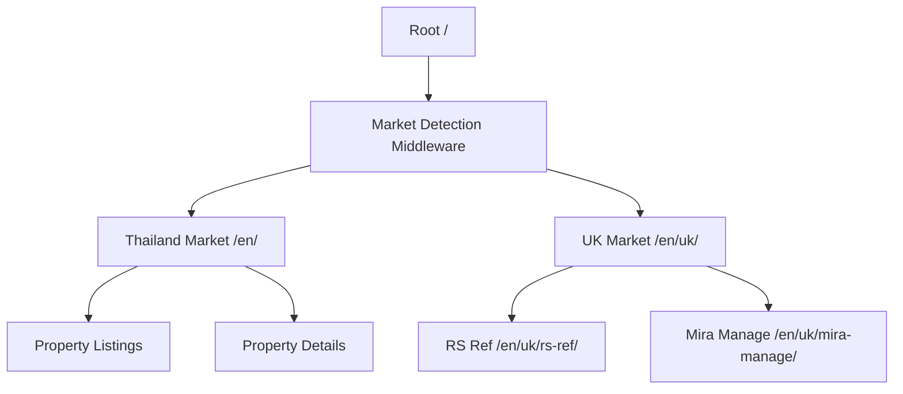

# 网站重构技术设计方案

## 概述

本文档详细描述了 miraa.homes 网站重构的技术设计方案。重构的核心目标是简化网站结构，从双市场（泰国房产 + 英国服务）模式转换为单一泰国房产展示平台，移除所有英国市场相关功能。

### 设计目标

1. **简化架构**：移除复杂的市场选择逻辑，统一为单一房产展示平台
2. **提升性能**：通过删除未使用代码和组件，减少JavaScript包体积
3. **优化SEO**：简化URL结构，提升搜索引擎友好度
4. **保持核心功能**：确保房产展示、多语言支持等核心功能完整保留
5. **提高维护性**：简化代码结构，降低维护复杂度

### 技术栈保持

- **框架**：Next.js 14 App Router
- **语言**：TypeScript
- **样式**：Tailwind CSS
- **国际化**：next-intl
- **部署**：AWS (现有架构)

## 架构设计

### 当前架构问题



**问题点：**
1. 复杂的市场检测和路由逻辑
2. 双重导航系统（泰国 vs 英国）
3. 重复的布局和样式定义
4. 混合的业务逻辑和用户体验流程
### 目标架构

```mermaid
graph TD
    A[Root /] --> B[Locale Middleware]
    B --> C[/en/ - English]
    B --> D[/ru/ - Russian]
    B --> E[/fr/ - French]
    B --> F[/de/ - German]
    B --> G[/es/ - Spanish]
    B --> H[/it/ - Italian]
    C --> I[Property Listings]
    C --> J[Property Details /properties/[id]]
    D --> K[Property Listings RU]
    E --> L[Property Listings FR]
```

**优势：**
1. 单一业务焦点：泰国房产展示
2. 简化的国际化路由
3. 统一的用户体验
4. 更好的SEO表现
5. 降低维护复杂度

## 组件和接口设计

### 核心组件架构

```typescript
// 组件层级结构
src/
├── app/
│   ├── [locale]/
│   │   ├── layout.tsx           // 保留并简化
│   │   ├── page.tsx             // 首页房产展示
│   │   ├── properties/
│   │   │   └── [id]/
│   │   │       └── page.tsx     // 房产详情页
│   │   └── not-found.tsx        // 404页面
├── components/
│   ├── layout/
│   │   ├── Navbar.tsx           // 需要重构
│   │   └── Footer.tsx           // 需要更新链接
│   ├── home/
│   │   ├── HeroSection.tsx      // 保留
│   │   └── FeaturedProperties.tsx // 保留
│   ├── property/
│   │   ├── PropertyCard.tsx     // 保留
│   │   ├── ImageCarousel.tsx    // 保留
│   │   └── PanoramaViewer.tsx   // 保留
│   ├── common/
│   │   ├── LanguageSwitcher.tsx // 保留
│   │   └── ContactButton.tsx    // 保留
│   └── tracking/
│       └── TrackingScripts.tsx  // 保留
```
### 删除的文件和组件

#### 页面文件删除列表
```
删除文件：
├── app/[locale]/uk/                    // 整个UK目录
│   ├── page.tsx                        // 英国服务主页
│   ├── rs-ref/
│   │   └── page.tsx                   // RS Ref评估系统页面
│   └── mira-manage/
│       └── page.tsx                   // Mira Manage物业管理页面
```

#### 组件清理
- 移除 Navbar.tsx 中的市场切换器逻辑
- 移除 UK 服务相关的生态系统图表组件
- 清理未使用的样式类和变量

### 接口设计

#### 导航接口简化

```typescript
// 当前导航接口（复杂）
interface NavLink {
  label: string;
  href: string;
  market?: 'th' | 'uk';  // 移除市场概念
}

// 新的导航接口（简化）
interface NavLink {
  label: string;
  href: string;
  section?: string;  // 可选的页面锚点
}

// 新的导航配置
const navLinks: NavLink[] = [
  { label: t('home'), href: `/${locale}` },
  { label: t('properties'), href: `/${locale}#featured` },
  { label: t('contact'), href: `/${locale}#contact` }
];
```

#### 路由配置简化

```typescript
// middleware.ts 重构前（复杂市场检测）
function detectMarket(request: NextRequest): "th" | "uk" {
  const country = request.headers.get("CF-IPCountry") || "";
  return country.toUpperCase() === "TH" ? "th" : "uk";
}

// middleware.ts 重构后（简化国际化）
export default function middleware(request: NextRequest) {
  return intlMiddleware(request);  // 仅处理语言路由
}
```
## 数据模型

### 房产数据模型（保持不变）

```typescript
interface Property {
  id: string;
  title: Record<string, string>;        // 多语言标题
  description: Record<string, string>;  // 多语言描述
  price: {
    amount: number;
    currency: string;
    period?: string;  // 'month' | 'year' | null (sale)
  };
  location: {
    district: string;
    city: string;
    coordinates?: {
      lat: number;
      lng: number;
    };
  };
  specifications: {
    bedrooms: number;
    bathrooms: number;
    area: number;
    landSize?: number;
    floors?: number;
  };
  images: {
    main: string;
    gallery: string[];
    panorama?: string;  // 360度全景图片URL
  };
  amenities: string[];
  status: 'available' | 'sold' | 'rented';
  featured: boolean;
  createdAt: string;
  updatedAt: string;
}
```

### 元数据配置

```typescript
interface PageMetadata {
  title: Record<string, string>;
  description: Record<string, string>;
  keywords: Record<string, string[]>;
  ogImage?: string;
  canonicalUrl?: string;
}

// 首页元数据配置
const homeMetadata: PageMetadata = {
  title: {
    en: "Mira Real Estate — Luxury Villas in Koh Samui, Thailand",
    ru: "Mira Real Estate — Роскошные виллы на Ко Самуи, Таиланд",
    fr: "Mira Real Estate — Villas de luxe à Koh Samui, Thaïlande",
    // ... 其他语言
  },
  description: {
    en: "Discover premium villas and townhouses in Koh Samui. Professional property services with 360° virtual tours.",
    // ... 其他语言翻译
  }
};
```
## 正确性属性

*正确性属性是指在系统所有有效执行过程中都应该保持为真的特征或行为——本质上是关于系统应该做什么的正式陈述。属性在人类可读的规范和机器可验证的正确性保证之间搭建了桥梁。*

### 属性反思

在分析需求的测试性之后，我识别出以下可以通过属性测试验证的通用属性：

**多语言路由属性：** R1.3 和 NR4.1 都涉及多语言支持，可以合并为一个综合属性，测试任意支持的语言都能正确工作。

**房产功能属性：** R3.1 和 R3.2 都涉及房产数据展示，可以合并为一个属性，测试任意房产数据都能正确显示。

**SEO元数据属性：** NR2.1 涉及meta标签更新，这是一个可以对所有页面验证的通用属性。

### 属性 1: 多语言路由完整性

*对于任何* 支持的语言代码（en, ru, fr, de, es, it），路由系统应该正确解析语言路径并显示对应语言的完整内容。

**验证：需求 R1.3, NR4.1**

### 属性 2: 房产数据展示完整性  

*对于任何* 有效的房产数据对象，系统应该在首页和详情页正确显示所有必要信息（标题、价格、图片、规格等）。

**验证：需求 R3.1, R3.2**

### 属性 3: 图片组件渲染稳定性

*对于任何* 有效的图片数组，图片轮播组件应该正确显示所有图片并支持导航功能，360度全景组件应该正确加载全景图片。

**验证：需求 R3.3**

### 属性 4: SEO元数据清洁性

*对于任何* 网站页面，页面的meta标签、标题和描述中都不应包含英国服务相关的关键词（如"RS Ref"、"Mira Manage"、"UK"等）。

**验证：需求 NR2.1**
## 错误处理

### 404 页面处理

```typescript
// app/[locale]/not-found.tsx 增强
export default function NotFound() {
  const t = useTranslations('errors');
  
  return (
    <div className="min-h-screen flex items-center justify-center">
      <div className="text-center">
        <h1 className="text-4xl font-bold text-dark-gray mb-4">
          {t('404.title')}
        </h1>
        <p className="text-gray-500 mb-8">
          {t('404.message')}
        </p>
        <Link 
          href="/"
          className="bg-ocean-blue text-white px-6 py-3 rounded-full hover:bg-blue-600 transition-colors"
        >
          {t('404.backHome')}
        </Link>
      </div>
    </div>
  );
}
```

### 重定向处理

```typescript
// 处理旧的UK路径重定向
const ukRedirects = {
  '/en/uk': '/',
  '/en/uk/rs-ref': '/',
  '/en/uk/mira-manage': '/',
  // 其他语言的UK路径
  '/ru/uk': '/ru',
  '/fr/uk': '/fr',
  // ... 所有语言变体
};

// 在 middleware.ts 中添加重定向逻辑
export default function middleware(request: NextRequest) {
  const { pathname } = request.nextUrl;
  
  // 处理UK路径重定向
  if (pathname.includes('/uk')) {
    const locale = pathname.split('/')[1] || 'en';
    const newPath = locale === 'en' ? '/' : `/${locale}`;
    return NextResponse.redirect(new URL(newPath, request.url));
  }
  
  return intlMiddleware(request);
}
```

### 数据获取错误处理

```typescript
// lib/properties.ts 增强错误处理
export async function getProperties(): Promise<Property[]> {
  try {
    const data = await fetchFromDynamoDB();
    return data.filter(property => property.status === 'available');
  } catch (error) {
    console.error('获取房产数据失败:', error);
    return []; // 返回空数组而不是抛出错误
  }
}

export async function getProperty(id: string): Promise<Property | null> {
  try {
    const property = await fetchPropertyFromDynamoDB(id);
    if (!property || property.status === 'deleted') {
      return null;
    }
    return property;
  } catch (error) {
    console.error(`获取房产 ${id} 失败:`, error);
    return null;
  }
}
```
## 测试策略

### 双重测试方法

本项目采用单元测试和集成测试相结合的策略，确保重构的完整性和正确性：

**单元测试**：验证具体示例、边缘情况和错误条件
- 特定组件的渲染测试
- 路径删除验证（404检查）
- UI元素存在性检查

**属性测试**：验证跨所有输入的通用属性（当适用时）
- 多语言路由完整性测试
- 房产数据展示一致性测试
- 图片组件功能稳定性测试
- SEO元数据清洁性测试

### 属性测试配置

**属性测试库**：使用 `fast-check` 进行属性测试（已在 package.json 中）
**最小迭代次数**：每个属性测试运行 100 次迭代
**标记格式**：**Feature: website-restructure, Property {number}: {property_text}**

### 测试计划

#### 1. 删除功能验证测试

```javascript
// 单元测试示例
describe('UK路径删除验证', () => {
  test('UK服务主页应返回404', async () => {
    const response = await fetch('/en/uk');
    expect(response.status).toBe(404);
  });
  
  test('RS Ref页面应返回404', async () => {
    const response = await fetch('/en/uk/rs-ref');
    expect(response.status).toBe(404);
  });
  
  test('Mira Manage页面应返回404', async () => {
    const response = await fetch('/en/uk/mira-manage');
    expect(response.status).toBe(404);
  });
});
```

#### 2. 导航组件测试

```javascript
describe('导航栏简化验证', () => {
  test('不应包含市场切换器', () => {
    render(<Navbar />);
    expect(screen.queryByText('🇬🇧 UK')).not.toBeInTheDocument();
    expect(screen.queryByText('Thailand')).not.toBeInTheDocument();
  });
});
```

#### 3. 属性测试实现

```javascript
// **Feature: website-restructure, Property 1: 多语言路由完整性**
describe('多语言路由属性测试', () => {
  test('任意支持的语言都应正确工作', async () => {
    await fc.assert(fc.asyncProperty(
      fc.constantFrom('en', 'ru', 'fr', 'de', 'es', 'it'),
      async (locale) => {
        const response = await fetch(`/${locale}`);
        expect(response.status).toBe(200);
        const html = await response.text();
        expect(html).toContain(`lang="${locale}"`);
      }
    ));
  });
});

// **Feature: website-restructure, Property 2: 房产数据展示完整性**
describe('房产数据展示属性测试', () => {
  test('任意房产数据都应正确显示', async () => {
    await fc.assert(fc.asyncProperty(
      generatePropertyData(), // 自定义生成器
      async (property) => {
        // 测试首页显示
        render(<FeaturedProperties properties={[property]} />);
        expect(screen.getByText(property.title.en)).toBeInTheDocument();
        expect(screen.getByText(property.price.amount.toString())).toBeInTheDocument();
      }
    ));
  });
});
```
#### 4. 性能测试

```javascript
describe('性能优化验证', () => {
  test('JavaScript包体积应减少', async () => {
    const buildStats = await getBuildStats();
    const jsSize = buildStats.assets
      .filter(asset => asset.name.endsWith('.js'))
      .reduce((total, asset) => total + asset.size, 0);
    
    // 假设重构前的基准大小
    const baselineSize = 500 * 1024; // 500KB
    expect(jsSize).toBeLessThan(baselineSize * 0.8); // 减少20%
  });
});
```

#### 5. SEO测试

```javascript
// **Feature: website-restructure, Property 4: SEO元数据清洁性**
describe('SEO元数据清洁性属性测试', () => {
  test('任意页面都不应包含英国服务关键词', async () => {
    const ukKeywords = ['RS Ref', 'Mira Manage', 'UK Property', 'reference letters'];
    
    await fc.assert(fc.asyncProperty(
      fc.constantFrom('/', '/properties/1', '/ru', '/fr'),
      async (path) => {
        const response = await fetch(path);
        const html = await response.text();
        
        ukKeywords.forEach(keyword => {
          expect(html.toLowerCase()).not.toContain(keyword.toLowerCase());
        });
      }
    ));
  });
});
```

### 集成测试策略

#### 端到端用户流程测试

```javascript
describe('完整用户流程', () => {
  test('用户浏览房产流程', async () => {
    // 1. 访问首页
    await page.goto('/en');
    await expect(page).toHaveTitle(/Mira Real Estate/);
    
    // 2. 查看房产列表
    await expect(page.locator('[data-testid="property-card"]')).toBeVisible();
    
    // 3. 点击房产详情
    await page.locator('[data-testid="property-card"]').first().click();
    await expect(page).toHaveURL(/\/properties\/\d+/);
    
    // 4. 查看图片轮播
    await expect(page.locator('[data-testid="image-carousel"]')).toBeVisible();
    
    // 5. 切换语言
    await page.locator('[data-testid="language-switcher"]').click();
    await page.locator('text=Русский').click();
    await expect(page).toHaveURL(/\/ru\//);
  });
});
```

### 测试覆盖率目标

- **单元测试覆盖率**：> 90%
- **集成测试覆盖率**：主要用户流程 100%
- **属性测试**：所有识别的属性 100%
- **错误场景覆盖**：404处理、数据获取失败、网络错误